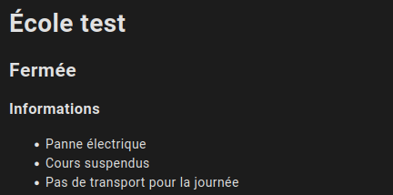
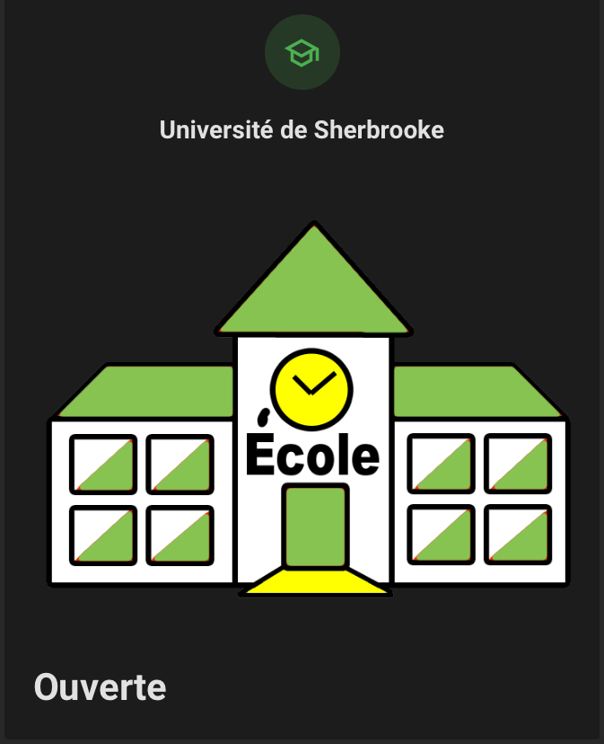
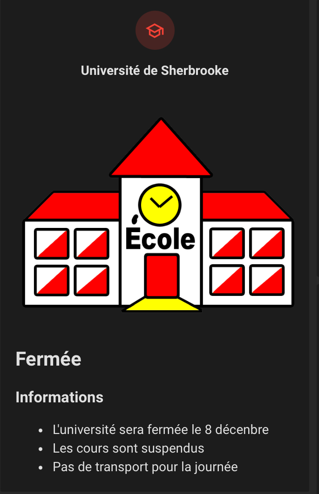
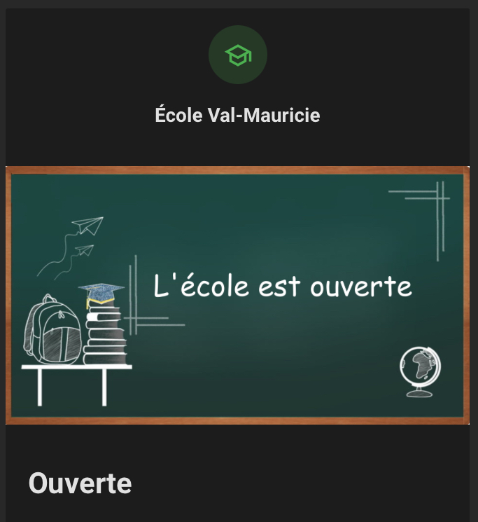
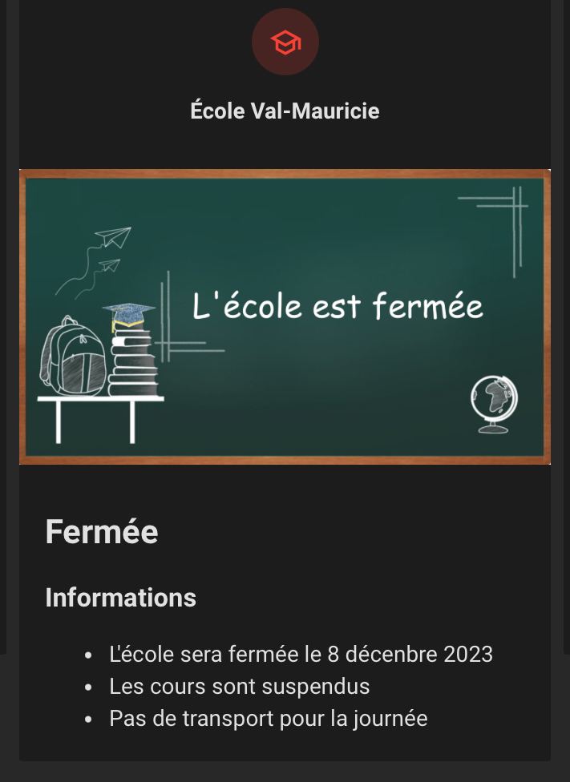

# Écoles fermées

TVA fourni une liste des fermeture d'écoles au format json pour présentation sur leur site web.

## Données

Un exemple de données extraites est disponible dans le dossier [donnees](donnees).

- Liste des école et leur id: [https://www.tvanouvelles.ca/api/schools/list](https://www.tvanouvelles.ca/api/schools/list)

- Liste des fermetures: [https://www.tvanouvelles.ca/api/schools/closed](https://www.tvanouvelles.ca/api/schools/closed)

Selon les écoles un message peut être indiqué dans la section de fermeture et/ou dans un tableau.

Le fichier des fermetures contient uniquement les écoles qui sont présentement fermées.

### Outils de développement

Vous trouverez dans le dossier [donnes/bruno](donnes/bruno) une collection qui peut être importée et utilisée avec l'outil [Bruno](https://www.usebruno.com/).

## Installation

### Home-Assistant

Les configurations Home-Assistant du projet Domo-Québec s'installent sous forme de ["package" Home-Assistant](https://www.home-assistant.io/docs/configuration/packages/). Pour faire l'activation de la fonctionnalitée créé un dossier nommé "packages" à la racine de votre dossier de configuratio Home-Assistant et ajoutez la configuration suivante à votre fichier `configuration.yaml`

```yaml
homeassistant:
  packages: !include_dir_named packages
```

Le dossier [home-assistant/packages](home-assistant/packages) contient un fichier nommé `fermeture-ecoles.yaml` qui doit être déplacé dans le dossier "packages" de votre installation Home-Assistant.

#### Configuration

Faites un "Rechercher et remplacer" dans le fichier `fermeture-ecoles.yaml` et remplacer les valeurs identifiées au début du fichier par les valeurs correspondantes.

Vous pouvez trouver la liste des id dans le fichier [list.md](list.md). Il ne se mets pas à jour automatiquement donc en cas de doute vérifiez à même le lien dans la section Extraction des données

#### Cartes Lovelace

Un exemple de carte lovelace est disponible dans le dossier lovelace

##### Visuel Markdown




##### Visuel École





##### Visuel Tableau




